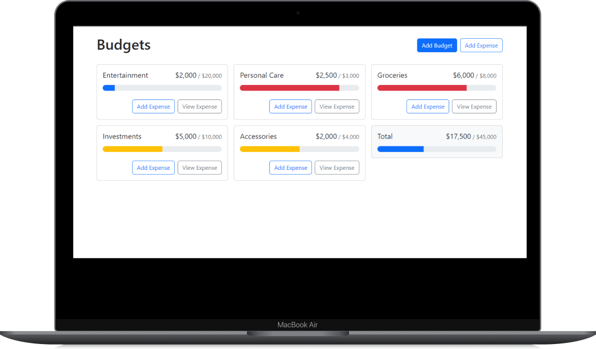

# 💰 React Budget App

This is a simple budget app built using React. It allows users to add different budgets, add expenses to the current budgets, display all budgets, display expenses, delete budgets & expenses, and offers functionality to get total budgets and expenses.

## ✨ Features

- Add new budgets
- Add expenses to existing budgets
- Display all budgets
- Display expenses for each budget
- Delete budgets and expenses
- Get total budgets and expenses

---

## 🛠️ Technologies Used

- React
- JavaScript
- CSS

---

## 📝 Installation

1. Clone the repository:

   ```bash
   git clone https://github.com/Bushra-naeem/react-budget-app.git
   ```

2. Navigate to the project directory:

   ```bash
   cd react-budget-app
   ```

3. Install the dependencies:

   ```bash
   npm install
   ```

4. Start the application:
   ```bash
   npm start
   ```

---

## 🚀 Usage

- Open your browser and navigate to http://localhost:3000
- Add new budgets and expenses
- View and manage your budgets and expenses

---

## 📋 Process

1. Plan the project structure and components.
2. Implement the budget and expense management features.
3. Style the application using CSS.
4. Test the application to ensure functionality.
5. Deploy the application on a hosting platform.

---

## 📸 Take a look



## 🤝 Contributing

Contributions are welcome! Please open an issue or submit a pull request for any changes.

---

## Connect With Me 🌐

**Follow me on social media:**

- [Linkedln](https://www.linkedin.com/in/bushra-naeem-5b9329246/)
- [Instagram](https://www.instagram.com/_.bushra.00/)
